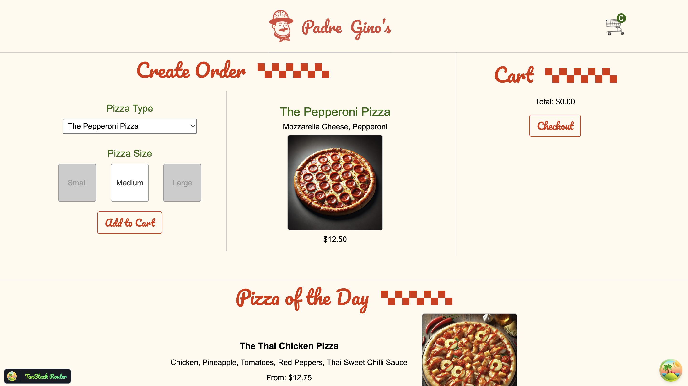

# Padre Gino's — React Practice App

A small pizza-ordering app built while working through modern React patterns: hooks,
context, portals, error boundaries, TanStack Router and TanStack Query — served by a
Fastify + SQLite API.



## Features

- **Order page** — pick a pizza type and size, see live pricing, add to a cart and check out.
- **Past orders** — paginated order history backed by TanStack Query, with a modal for order details.
- **Pizza of the Day** — a custom hook (`usePizzaOfTheDay`) that fetches the daily special.
- **Contact form** — submitted with `useMutation`.
- **Error boundary** — class-component boundary wrapping the past-orders route.
- **Modal via portal** — rendered into a separate `#modal` root.

## Stack

| Layer     | Tooling |
| --------- | ------- |
| UI        | React 18 |
| Routing   | TanStack Router (file-based, lazy routes) |
| Data      | TanStack Query |
| Build     | Vite |
| API       | Fastify, SQLite (`promised-sqlite3`) |
| Quality   | ESLint, Prettier |

## Getting started

Two processes: the API on port `3005` and the Vite dev server, which proxies
`/api` and `/public` to it.

```bash
# 1. API
cd api
npm install
npm run dev        # http://localhost:3005

# 2. Frontend (from the repo root, in another terminal)
npm install
npm run dev        # http://localhost:5173
```

## Scripts

| Command | What it does |
| ------- | ------------ |
| `npm run dev` | Start the Vite dev server |
| `npm run build` | Production build |
| `npm run preview` | Serve the production build |
| `npm run lint` | Run ESLint |
| `npm run format` | Format `src/` with Prettier |

## Project layout

```
src/
  App.jsx              # Entry: router + query client providers
  routes/              # File-based routes (__root, index, order, past, contact)
  api/                 # Fetch helpers (getPastOrders, getPastOrder, postContact)
  contexts.jsx         # CartContext
  usePizzaOfTheDay.jsx # Custom hook
  ErrorBoundary.jsx    # Class component boundary
  Modal.jsx            # createPortal modal
api/
  server.js            # Fastify API
  pizza.sqlite         # Seeded database
  public/              # Pizza images, stylesheet, fonts
```

## API endpoints

| Method | Route | Purpose |
| ------ | ----- | ------- |
| GET  | `/api/pizzas` | All pizzas |
| GET  | `/api/pizza-of-the-day` | Daily special |
| GET  | `/api/orders` | Orders |
| GET  | `/api/order` | Single order |
| POST | `/api/order` | Create an order |
| GET  | `/api/past-orders` | Paginated history |
| GET  | `/api/past-order/:order_id` | Order details |
| POST | `/api/contact` | Contact form |

## Notes

- `src/routeTree.gen.ts` is generated by the TanStack Router Vite plugin and is gitignored —
  it appears once the dev server runs.
- Router and Query devtools are mounted in the root route.
